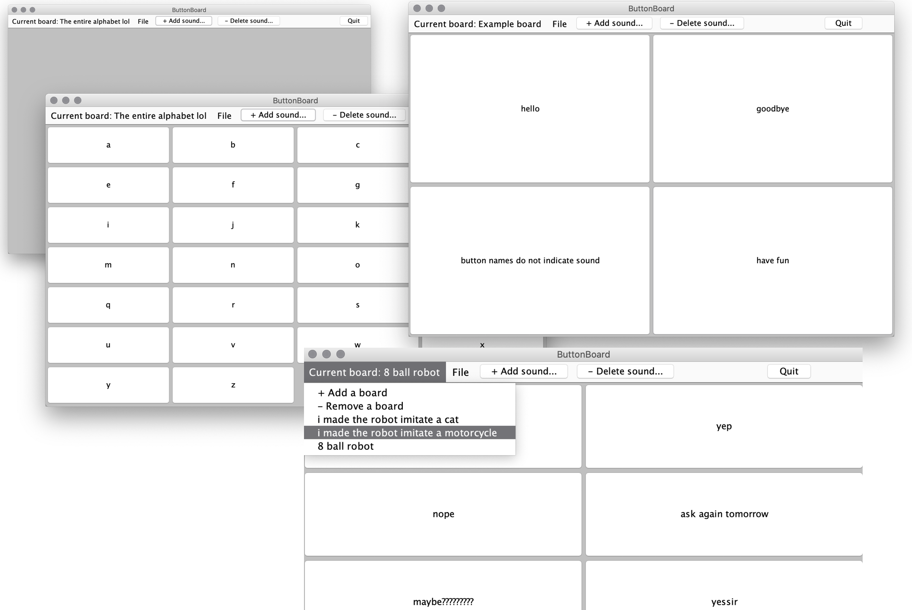

# ButtonBoard
... is a simple soundboard application made for CPSC 210's open-ended Java project

## Features 
- Add, name, and delete soundboards
- Navigate between the soundboards
- Add, name, delete, and assign sounds to "buttons" on the soundboards
- Play text-to-speech sounds by clicking these buttons
- Save/load the state to/from a text file

## TODO list
- Board and buttons are deleted like a queue, and can't be picked for deletion
- Improve calculation of rows/cols of buttons

## Work used
Text to speech synthesizer library used: FreeTTS
https://freetts.sourceforge.io/

"New board sound" audio from: http://soundbible.com/2156-Text-Message-Alert-3.html
Title: Text Message Alert 3
Uploaded: 9.2.16
License: Attribution 3.0
Recorded by Daniel Simion 
